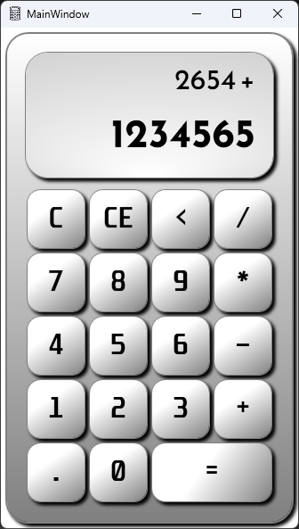

# WpfAppCalculator

A calculator application built with **WPF (Windows Presentation Foundation)**, demonstrating the use of XAML styles and templates.

## 📸 Preview

##  Getting Started

### Requirements
- Windows (10, or 11)
- .NET 9.0 or newer (Download from the official [.NET website](https://dotnet.microsoft.com/en-us/download))

### How to Run
1. Go to the [Releases](../../releases) page.
2. Download the ZIP file.
3. Unzip it into an empty folder.
4. Run `WpfAppCalculator.exe`.

## Download
[⬇️ **Get the latest release**](../../releases/latest)
